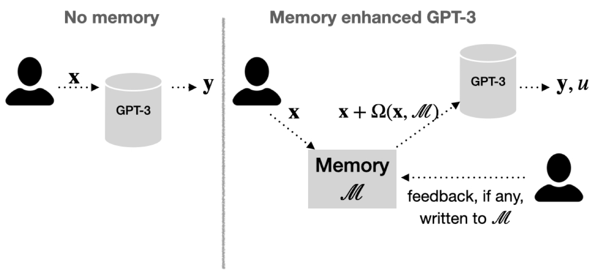

# Memory-assisted prompt editing to improve GPT-3 after deployment

Code for our work [Memory-assisted prompt editing to improve GPT-3 after deployment](https://arxiv.org/abs/2201.06009?context=cs)



## Running a job

* _Please note that you need to `export OPENAI_API_KEY="YOUR_OPENAI_KEY` before running the scripts._

* The required libraries are listed in the requirements.txt file.

### Streaming with memory

* To run a streaming job using memory, run the following command:

```sh
python memprompt/stream_with_memory.py --task_file ${FILE} \
                                        --job_id ${JOB_ID} \
                                        --getting_clarification_probability ${CLARIFICATION_PROB} \
                                        --memory_type ${MEMORY_TYPE} \
                                        --checkpoint_path ${CHECKPOINT_PATH} \
                                        --prompt_path ${PROMPT_PATH}
```

* Where:

    - `FILE` is the path to the task file
    - `JOB_ID` is the job ID
    - `CLARIFICATION_PROB` is the probability of getting clarification from the user
    - `MEMORY_TYPE` is the type of memory to use. Can be `closest` or `semantic`
    - `CHECKPOINT_PATH` is the path to the trained memory checkpoint file, only needed if `MEMORY_TYPE` is `semantic`
    - `PROMPT_PATH` is the path to the prompt file. Currently, we have two prompts located in `data/prompts/`, one for the lexical QA tasks (`data/prompts/prompt_lexical_qa.txt`) and the other for the GPT-3 synthetic word tasks (`data/prompts/prompt_gpt3_synthetic_tasks.txt`)

For example, to run a job with 10 samples on the linguistic variation prompts with a clarification probability of 0.5 and closest memory, run:

```sh
python stream_with_memory.py --task_file tasks/linguistic/tasks_10.jsonl \
                                 --job_id  linguistic \
                                 --getting_clarification_probability 0.5 \
                                 --memory_type closest
```

* After the job finishes, it'll create a log file in `logs/` in the form: `logs/${task_type}_num_tasks=${num_samples}_clarification_prob=${clarification_prob}_job_id=${job_id}_${timestamp}.jsonl`. For the sample script, the file should be: `closest_memory_task_type=linguistic_num_tasks=10_clarification_prob=0.5_ts=TS.jsonl`.

* To run a job with trained retriever, please download the checkpoint from this [anonymous URL](https://anonymshare.com/z8Nm/trained-memory.pt), and set the `CHECKPOINT_PATH` to the path of the checkpoint. Please note that the checkpoint may be deleted by the hosting service after a while. We are sorry for the inconvenience, and promise to make the checkpoint available upon acceptance.

* The `tasks` folder provides several different task files of various sizes and types for you to try out.

### Stream with growing prompt

* The usage is similar to the streaming with memory, but the prompt grows as the job proceeds.

```sh
python memprompt/stream_with_growing_prompt.py  --task_file memprompt/tasks/linguistic/tasks_10.jsonl\ 
                                                --job_id  linguistic \
                                                --getting_clarification_probability 0.5
```

* The default prompt is `prompt.txt` in the current directory.

## Run logs

* The log files created in `logs` are jsonl, where each line is a json object which contains varuous details about the job.

```js
{
    "question": "what has a < sonny > like ring to it ?",
    "expected_answer": "the homonym for sonny is sunny",
    "generated_answer": " the homonym for sonny is stunny ",
    "response": {
        "id": "",
        "object": "text_completion",
        "created": 1637049359,
        "model": "davinci:2020-05-03",
        "choices": [{
            "text": " the homonym for sonny is stun ",
            "index": 0,
            "logprobs": null,
            "finish_reason": "stop"
        }]
    },
    "is_correct": true,
    "correct_so_far": 57.14,
    "idx": 6,
    "memory_metadata": {
        "memory_used": true,
        "memory_size": 1,
        "content": "what has a like ring to it: clarification: when I ask for a word that has a similar ring to it , I want a homonym.",
        "match_score": 0,
        "query_for_memory_lookup": "what has a like ring to it",
        "memory_key": "what has a like ring to it",
        "memory_value": "clarification: when I ask for a word that has a similar ring to it , I want a homonym."
    },
    "elapsed_time": 707385024
}
```

## Creating new tasks

* New tasks can be created by running the following command:

```sh
python memprompt/task_handler.py --dump --n n  --template_class task --raw_file raw_files
```

Where:

    

        - `n` is the number of tasks to create
        - `task` is the task type (hin, pun, or linguistic)
        - `raw_files` is a comma-separated list of raw files to use. These files contain the actual examples that are included in the tasks.

The generated task files are stored in `tasks/task_type/tasks_n.jsonl` .

* For example, to create a file with 500 tasks of type `hin` (Hindi prompts):

```sh
python memprompt/task_handler.py 500 hin
```

This creates a file `tasks/hin/tasks_500.jsonl` with 500 tasks.

* To create a file with 300 tasks of type `synthetic_gpt3`:

```sh
python task_handler.py --dump --n 300 --template_class synthetic_gpt3 --task_files data/gpt3-word-tasks/raw.jsonl
```

This creates a file `tasks/synthetic_gpt3/tasks_300.jsonl` with 300 tasks.

## Processing logs

To list the progressive scores in a matrix form that can loaded into some Google sheets to generate charts:

```sh
python memprompt/utils.py --path memprompt/logs/ --pattern "task_type="
```

* Where:

    - `path` is the path to a single jsonl log file or a directory containing multiple files.
    - `pattern` matches the files within a path directory to process logs.
    - `out_path` is the output path to store the results.

## Task files

The directory structure is `tasks/<task_name>/tasks_<num_tasks>.jsonl` .
The current task files are:

```
tasks/
├── hin
│   ├── tasks_1000.jsonl
│   └── tasks_100.jsonl
├── linguistic
│   ├── tasks_1000.jsonl
│   ├── tasks_100.jsonl
│   └── tasks_10.jsonl
└── pun
    ├── tasks_1000.jsonl
    └── tasks_100.jsonl
```
